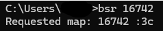
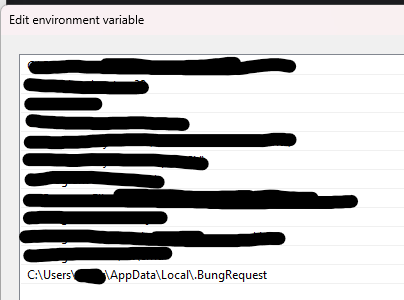

## Meow :3c (aka installation)
* U can do this in cmd and powershell!
* 
* Just add path to the exe in ur enviroment variables like this! (the file can be placed anywhere, u choose :3)
* 

## Author
* BungiCraft - Meow :3c
