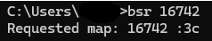

# BungOfflineRequestCLI

A simple CLI tool for the BungOfflineRequest plugin.

Enables you to do this!

## Features

- Request BSR codes to yourself, that later are used by the [BungOfflineRequest](https://github.com/BungiCraft/BungOfflineRequest) plugin to show up in game.
- Supports multiple codes at once!
- Easy to use, just type `bsr <bsr-code>` in your terminal.
- No need to open the game to request a BSR code.
- Also filters out invalid codes, so no need to worry about that.
- That means you can just copy and paste the codes from beatsaver and it will work! (even using the "Copy BSR" button on beatsaver that includes the "!bsr" command, it'll get filtered :3).

## Usage

- `bsr <bsr-code>` - Request a BSR code to yourself like this.
- `bsr <bsr-code1> <bsr-code2> <bsr-code3> ` - Supports multiple codes at once, just separate them with a space!

## Installation

Just put the exe file anywhere you want, and add the path to your environment variables.

Also needs the [BungOfflineRequest](https://github.com/BungiCraft/BungOfflineRequest) plugin to be useful, without it, it's just a tool that does nothing KEKW.

If u don't want to add it to your environment variables u can still use this tool, but then you wouldn't be able to just write "bsr" into cmd or powershell without not first pointing it to the location of the exe.

### How to add environment variables (Windows)

1. Open the start menu and search for "Environment Variables".
2. Click on "Edit environment variables for your account".
3. Find the "Path" variable in the list and click on "Edit".
4. Click on "New" and paste the path to the folder where the exe is located.
5. Click "OK" on all the windows to save the changes.
6. Open a new terminal and type `bsr <bsr-code>` to see if it works.
7. Done!

## Author

BungiCraft - Meow :3c